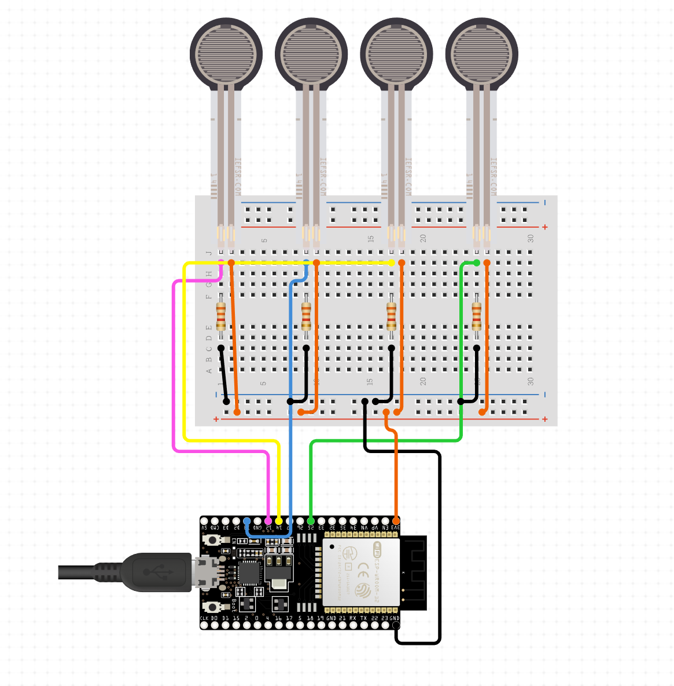

# NISE

This project proposes the development of a brain-to-brain communication system, enabling individuals to exchange sentences seamlessly. 
The sender, equipped with a soft glove embedded with force sensors, interacts with a user-friendly graphical interface, while the receiver decodes messages through vibrotactile motors.

The primary objective of this project is to establish a novel brain-to-brain communication system designed to serve as a play-therapy and socializing tool in rehabilitation settings. 
On one side, force sensors are integrated into a soft glove, whereas on the other side vibrotactile motors provide sensory feedback, 
thus addressing the distinct needs of two patient categories: those with fine motricity impariments, such as individuals affected by neuromotor disorders 
(e.g., Parkinson's, multiple sclerosis, post-stroke), and patients requiring feedback stimulation, including amputees or individuals with sensory deficits. 
Through this system, patients from the two groups could exchange sentences encoded via the soft glove on one side, and decoded via vibrations on the other side. 
This game-like therapy tool would be beneficial for many reasons. First, this novel approach allows for simultaneous rehabilitation and interaction between patients with diverse rehabilitation needs. 
In particular, patients with fine motricity impairments benefit from tailored motor exercises, while those requiring feedback stimulation experience enhanced sensory engagement. 
In this setting, the interactive shared game experience further contributes to a holistic and enriched rehabilitation journey: the game encourages meaningful communication and collaboration, 
fostering a social environment within the rehabilitation setting.

## Encoder
The circuit design for the machine encoder is depicted in Figure . 
It employs an ESP32 microcontroller that receives input from four highly reliable force sensors integrated into a glove. 
The determination of whether a sensor is pressed or not is made using a threshold value. Upon sensing a press, 
the sensor sends a corresponding number to a communication script written in Python. Each received number is then relayed to the graphical user interface. 
The interface displays a letter when three numbers are received, effectively translating the sensor inputs into a meaningful message.

  
  
Figure 1: Circuit design of the machine encoder

## Decoder

The circuit design for the machine decoder is depicted in Figure 2. In this setup, four vibrotactile motors are employed to convey messages received. The ESP32 microcontroller, connected via WiFi, receives a message consisting of three numbers from the encoder side. For each number received, the corresponding motor vibrates for 500 ms and then pauses for 250 ms. Upon receiving a single letter, the user can utilize a push button integrated into the circuit to access the next letter. This push button functionality enhances the participant's ability to distinguish between different messages and decode them more accurately. Consequently, it contributes to the creation of a more reliable communication system.

  
  
Figure 2: Circuit design of the machine decoder

## User Interface

The user interface is structured as a 4x4 grid, comprising 16 blocks, each housing two symbols. It includes all English letters, a dot, a question mark, a space, and a backspace option. Symbol selection involves a three-step process: the sender first chooses the column containing the desired symbol and then selects the specific row containing the symbol of interest. The final decision on the symbol is determined by the last number, which is either 1 or 2. In the case of an erroneous selection, the backspace symbol can be employed to delete the incorrect letter. All transmitted letters are displayed in the upper black segment of Figure~\ref{fig:GUI}.

## Communication Between Systems

## How to run the files?

The user should start by running the bmi_wifi_delay.py function since it serves as the sender in the communication process. Afterward, the select_key_delay.py function should be executed, leading to the appearance of a user interface on the screen.

The vibrotactile motors will vibrate based on the force sensor pressed. For the machine encoder circuit, you can find the Arduino code in 'NISE/esp32/force_sensor/force_sensor.ino'. 
Similarly, the code for the machine decoder circuit can be found in 'NISE/esp32/vibro_multi/vibro_wifi.ino'.
